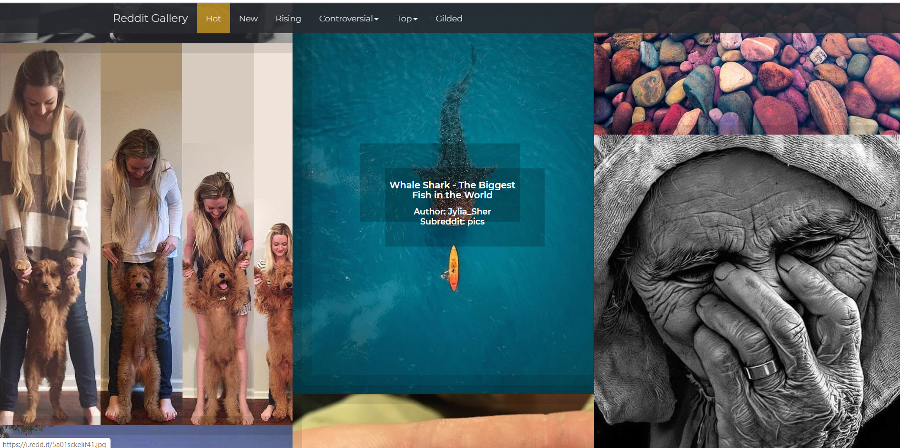

# Reddit-Gallery
<h2>Problem Statemnt/ Story</h2>

Ayush likes to view images on Reddit but doesn't like the UI much. He likes images from r/pics subreddit. He wants to build a frontend-only app to view images from the subreddit. Make it for him.

  
<h2>Development</h2>
<h3>Technologies Used</h3>
<ul>
  <li>HTML</li>
  
It is the basis of the web application for its structure. Made a navigation bar for the sorting of the images from the reddit page.

  <li>CSS + Bootstrap</li>
  
The design of the webpage and all the beautification to provide a good looking UI.

  
  <li>JavaScript and jQuery</li>
  
It is the brain of the web application and most of the hardwork was put in this

</ul>
  
<h2> Challenges and Learning</h2>
<ul>
  <li>For the Hot, New, Rising and Top categories. I just played around with the url and it was all done.</li>
  <li>Then I started looking at the JSON file and tried figuring out the way to reach to the data I needed. It was a little bit time taking but was an easy one.</li>
  <li>The Images were not showing but a few images showed error: 403 Forbidden or were getting repeated. Then I started to figure out what was causing the problem. And found that the url containing photos from imgur were not accessible or repeating two times because of imgur and i.imgur. So I removed all the photos whose url contained "imgur" leaving other urls including "i.imgur"</li>
  <li>Some extensions were also causing problem, so I also restricted the domain of extentions to .jpg, .png, .gif, .gifv</li>
  <li>Next challenge was to add everytime a new block of image, which was resolved by allotting new ID to every new image, hence restricting the repeatition of images which was the major problem I was facing.</li>
</ul>
